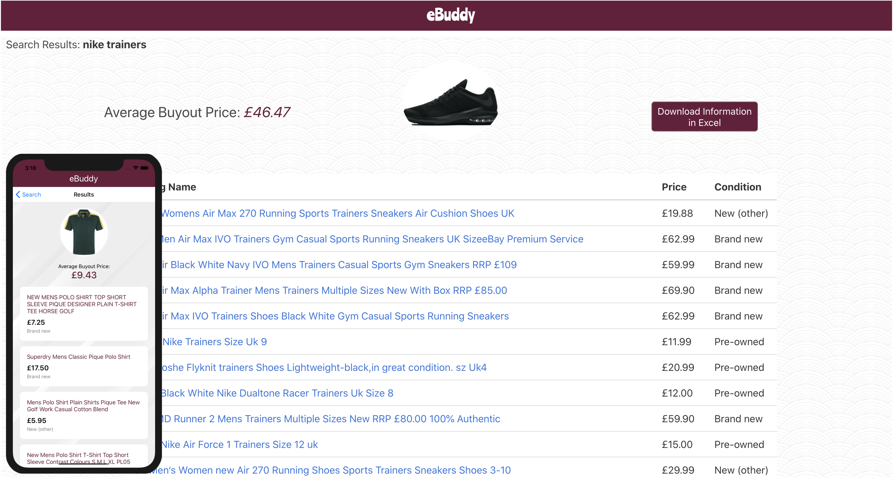
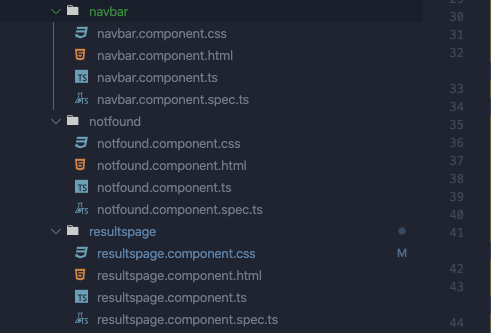
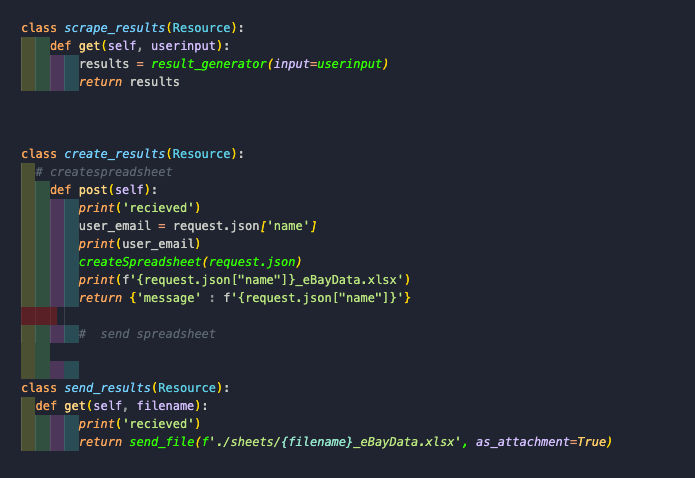
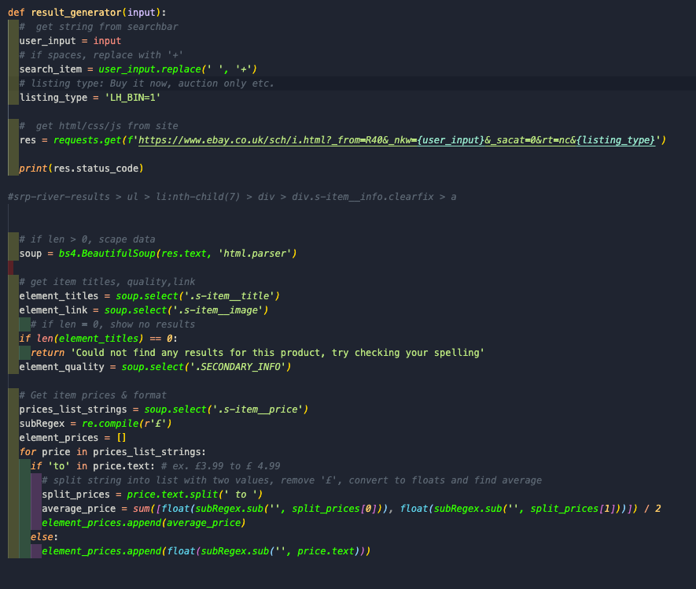
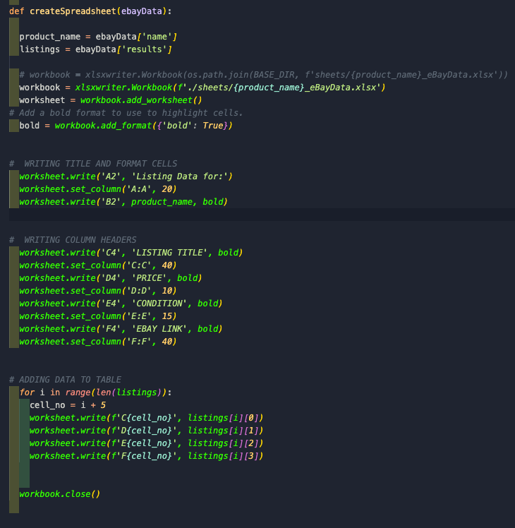

# eBuddy - eBay Quick Price Finder App
 
*NOTE:* Due to Heroku's ephemeral dyno behaviour and no permanent data storage has been provided, the download spreadsheet functionality is currently not yet implemented on live servers however this may still be achieved by running the app on localhost.

 
## Brief: Solo Project - Two Day Timespan
This project was conceptualized when my parents were spending too much time looking and checking prices on eBay/Gumtree when they were searching for bargains in charity shops and bootsales.
I wanted to build them a simple platform which enabled them to quickly identify a rough second-hand price for items to help them decide whether it would be worth the investment to buy and resell the item.
 
There were no particular requirements for this project however it was a great opportunity to do a sprint and experiment with some technology that was not covered on the General Assembly Bootcamp: Angular, React Native and Flask RESTful API.
 
It was useful to reinforce some of my previous knowledge on web scraping and writing files so I decided to incorporate this functionality into the app too. 
 
For ease of use, I built a version to run as a native app for mobile so it was not a requirement to open tabs in chrome’s native app with each use. 
 
***Note: Prior to deployment, I have made a few bug fixes and prepared the project for deployment but the core features were completed within 2 days, the React Native took an additional day as I needed to write a new set of code from scratch. More details on this below.***
 
## **1.0 - Overview**
 
eBuddy follows RESTful patterns with how the frontend interacts with the Flask API server - This would not be considered a full stack app because there was no need to introduce a database as no data is stored permanently on the app for future use.
 
The user input into the search bar will then make AJAX requests to the server to scrape the data from eBay’s listing pages. This data is then filtered and then returned to the user in an easy to read format, along with links to the individual listings.
 
The user may also wish to download an excel file of the listings for later use if desired.
  
## **2.0 Technology Summary**
 
### **2.1 - Client Side**
 
- Angular
- TypeScript
- React Native (Functional Components Only)
- Bulma Framework
- Flexbox
 
The client side was quite a quick process to build due to the simplicity of the layouts and there were only two views controlled by the Angular/React Router.
Ideally, it would have been faster to build the web version in React but I wanted to experience what Angular had to offer and see how TypeScript interacted with it. Flexbox was used in various areas to ensure the app is consistently responsive at most screen breakpoints.
 
### **2.2 - Server Side -**
 
- Flask / Python
- PyPI
- Flask_restful
- xlsxwriter
- beautifulsoup4
 
The server side was based around a Flask RESTful service and integrated a variety of in-built python libraries but also some third party packages from PyPI.
BeautifulSoup4 was the module which enabled the webscraping of eBay’s site and xlsxwriter allowed for writing the excel spreadsheets.
 
 
## **3.0 - Client Side**
 
### **3.1 - Angular Benefits and Drawbacks**
 
Angular was an interesting framework to try out but it felt relatively easy to pick up as the principles of passing data between components was similar to React so the learning curve felt a lot smoother. If I was a beginner to single page applications, I think this would have been a bit trickier to wrap my head around largely because of the new terminalogy specific to Angular. 
 
Possibly I am biased because I am quite familiar with React but I was not too keen on the amount of extra files that Angular would create when generating new components in the CLI. I could see the logic behind why they would keep the TypeScript, CSS and HTML files together in each component directory but it did result in a lot of open viewers most of the time and it did take up quite a bit of screen real estate.
JSX files from React felt like they flowed more naturally in my opinion.

 
The services were a nice addition as a place to handle the AJAX calls and then import them as and when needed throughout the app. Furthermore, with the support of TypeScript, it does feel like a very robust framework from what I could tell despite my app not requiring too much complex work to be done.
 
### **3.2 React Native Review**
 
Even though it was always planned to build a native version of the app, from a time saving point of view (and for maintenance purposes), it would have made sense to build the web app in React too because the component logic would have been almost identical. It would have just been a matter of revising the render part of the components and updating them with the mobile equivalents. 
 
Experimenting with Angular was something I wanted to try though and as this app was quick and simple, it was not too much of an issue to produce a fresh new app specifically for mobile. Plus the learning opportunities were valuable along the way.
 
React Native felt intuitive however I did miss the component tree that Google Chrome’s developer tools offered as I would utilize that section to review the state of my components all the time.
 
## **4.0 - Server Side**
 
### **4.1 - Flask**

 
Flask was an exceptionally fast microframework to get my server running and the simplicity of it was incredible. Overall, there are only three actively used python files in my project structure to handle the whole server side. 
 
`app.py` handles all the controllers in a simple syntax while the other two files are separated into their concerns: Webscraping and spreadsheet writing.
 
Going forward, I will highly consider using Flask for basic projects on sprints but I personally prefer the robustness of Django for most situations I believe I will encounter in the future. The fact that there was no database required meant that Flask was ideal for just providing a few simple endpoints to my client side.
 
### **4.2 - Webscraping**

 
Using beautifulsoup4 to webscrape was quite a fun process and it did require some regex work to make sure I was filtering out all the correct information I wanted. After reviewing webscraping further, there are some far more robust ways to get specific HTML content in beautifulsoup but I wanted to get the practice of regex in. 
 
This does leave the app exposed to the risks of crashing if eBay ever changes their website format so this is something that for now, I will keep a manual eye on but it is not essential.
 
### **4.3 - Writing Spreadsheets**
 
 

This was an interesting section to build as I had to play around with loops and tuples to get the data to be laid out in the correct cells of the spreadsheet. There was a little bit of trial and error but overall there have been no real issues with this. 
 
 
## **5.0 - Closing Notes**
 
### **5.1 - Notable Bugs**
 
- Error handling is quite limited on the web app version, particularly if the user tries to put a poorly spelt search input because eBay will not return any data to the webscraper if this is the case. The mobile app using React Native has error handling built in because that is the platform where the app will actually be used in real life situations.
 
- Due to the project being a sprint and with a limited target audience of my parents, it is unlikely I will return to fix this minor bug on the web version as time would be better spent on more significant future projects.
 
### **5.2 - Key Learning Point**
 
- I loved doing these fast paced projects to trial out new pieces of tech as it gives me the opportunity to assess more options when I start a new project about which tech to use for it.
Flask I could definitely see a use for and will continue to use it on smaller apps which have no requirements for a database but still need to perform a few RESTful actions. As soon as anything slightly more complex like CRUD functionality needs to be introduced, I will likely stick to using Django.

- I am pleased to now have options in terms of server side frameworks and I have  different opinions to how I approach projects in the future.
  
- Unless absolutely required, I have confirmed that I will be sticking with React for any single page applications because the bloated nature of Angular’s file system I felt was a bit messy and unnecessary particularly after using JSX files. A good experience but I would rather spend more time mastering React in future projects.
  
- Building native mobile apps was very enjoyable and the similarity to ReactDOM was quite surprising. As a result, I will be looking to see if it is possible to build native apps to supplement any React projects I work on because of the simple(ish) transition over and the fun of it.
 
